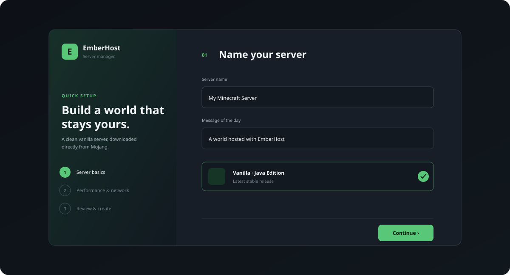

# EmberHost

EmberHost is a desktop control panel for turning a personal computer into a self-hosted Minecraft: Java Edition server. Paper is the recommended default for smoother play and plugin compatibility, while a verified Vanilla option remains available.

## What works today

- Lists every official Minecraft release in Mojang's manifest and creates any release for which Mojang publishes a server JAR.
- Recommends the newest stable Paper build, resolved from Paper's live API.
- Keeps Vanilla server creation available through Mojang's official metadata.
- Resolves and verifies the exact selected release instead of silently substituting the newest version.
- Downloads Paper, Vanilla, and Chunky only from allowlisted official hosts.
- Verifies Paper with SHA-256, Vanilla with Mojang's SHA-1, and Chunky with SHA-512 plus the declared file size.
- Resolves Minecraft's required Java major version instead of hardcoding it.
- Requires explicit Minecraft EULA acceptance before writing eula=true.
- Offers Balanced, Far View, and Maximum Performance profiles.
- Refreshes and prioritizes active LAN addresses when your computer changes networks.
- Uses safe G1GC launch flags for Paper and a larger initial heap only in the maximum-performance profile.
- Shows live Paper TPS, MSPT, process memory, CPU use, player count, and uptime.
- Pre-generates selected dimensions with Chunky from a configurable 256–20,000 block radius.
- Flushes the world, pauses autosave, creates a verified safety backup, and restores autosave before pregeneration begins.
- Automatically pauses pregeneration for connected players or unhealthy tick times and resumes when safe.
- Manages up to eight non-overlapping force-loaded regions, with a seven-chunk radius and 256 total chunks.
- Starts, stops, and monitors Java without invoking a shell.
- Sends a graceful stop command before escalating after a timeout.
- Streams output into a live console and a persistent, size-capped instance log.
- Persists multiple server configurations with atomic, schema-versioned JSON.
- Browses a curated catalog of common Paper plugins and resolves releases for the server's exact Minecraft version.
- Adds, inventories, and removes local Paper plugin JARs while the server is stopped.
- Moves deleted server folders and removable plugins to the operating system recycle bin instead of permanently erasing them.
- Preserves unknown comments and keys when updating server.properties.
- Keeps running in the system tray when the window closes.
- Keeps online mode enabled by default and never changes firewall or router settings automatically.

The tray process can run continuously while the desktop user remains signed in. EmberHost is not an operating-system service, so it does not survive logout, reboot, or an Electron crash. Conservative runtime ownership markers prevent a second copy of a server from starting when Java may have survived an abnormal exit.

## Paper, plugins, and mods

Paper supports Bukkit, Spigot, and Paper plugins. EmberHost installs the verified Chunky Paper plugin automatically because the World Tools screen depends on it. The **Plugins** screen includes a searchable, category-filtered catalog of 12 curated projects and still supports importing a local `.jar` file.

Catalog compatibility is resolved live from Modrinth for the server's exact Minecraft version and the Paper loader. Only listed stable releases are eligible for quick installation. EmberHost restricts downloads to the selected allowlisted project on Modrinth's CDN, verifies the declared byte size and SHA-512 hash, validates the JAR structure, and copies it atomically without loading or executing it. Projects with no exact stable release remain visible as unavailable instead of receiving a guessed build. Stop Paper before adding or removing plugins; changes load on the next start.

Plugins run with the same operating-system access as the Minecraft server. Only install plugins from developers you trust and confirm that the plugin supports the selected Minecraft and Paper versions. Chunky is protected from removal because World Preparation depends on it. Other removals go through the recycle bin.

Paper is not a Fabric, Forge, or NeoForge mod loader. Mods that require one of those loaders are not supported yet. Adding true modpack support would require loader-specific installers, dependency and version resolution, mod provenance and checksum tracking, per-loader launch rules, compatibility warnings, and safer update workflows.

## Performance tools

The profiles are intentionally understandable rather than mysterious:

| Profile | Default memory | View distance | Simulation distance | Best for |
| --- | ---: | ---: | ---: | --- |
| Balanced | 4 GB | 12 | 8 | Everyday play |
| Far View | 6 GB | 16 | 6 | Seeing farther without simulating every distant entity |
| Maximum Performance | 6 GB | 10 | 6 | Stable tick time and additional players |

Memory suggestions are capped against available system memory in the UI. Custom values remain available, and simulation distance cannot exceed view distance.

World preparation generates terrain before players travel through it, which removes most exploration-time chunk-generation spikes. Prepared chunks use disk space but do not remain active. Force-loaded regions are different: they stay ticking without a nearby player and therefore consume ongoing CPU and memory. EmberHost keeps those regions deliberately small and bounded.

Every preparation run writes a timestamped backup under emberhost-backups inside the server directory. Backups are not deleted automatically, so disk use should be reviewed periodically. If EmberHost cannot confirm that autosave was restored after a backup, it stops the server instead of continuing in an unsafe state.

## Requirements

- Windows 10/11, macOS, or a modern Linux desktop
- A supported 64-bit Java runtime for the selected Minecraft release
- Internet access for the initial metadata, server, and Chunky downloads
- At least 4 GB of available memory for the recommended Paper profile
- Additional SSD space for worlds and pregeneration backups

EmberHost reads javaVersion.majorVersion from Mojang's selected release metadata. If java is not on PATH, enter the full Java executable path during setup.

## Run from source

Install [Node.js](https://nodejs.org/) 22.12 or newer and pnpm 11, then:

~~~powershell
pnpm install
pnpm dev
~~~

Useful commands:

~~~powershell
pnpm test       # unit and service tests
pnpm build      # typecheck and production bundles
pnpm smoke      # isolated onboarding and dashboard Electron checks
pnpm dist       # platform installer
~~~

## Create and optimize a server

1. Launch EmberHost, choose a server name, and select an official Minecraft release.
2. Keep Paper selected when a stable build exists for that release, or choose Vanilla.
3. Select a performance profile and review the required Java version, memory, player limit, and port.
4. Read and explicitly accept the [Minecraft EULA](https://www.minecraft.net/en-us/eula).
5. Select **Download & create**, then start the server.
6. Open **Plugins** on a stopped Paper server to browse the curated catalog or add a trusted local plugin JAR.
7. Open **World Tools** on a Paper server to prepare terrain or add small force-loaded regions.

Mojang's manifest includes a few very early client releases for which it no longer publishes a server artifact. EmberHost shows those releases but refuses creation with a clear message rather than downloading an unofficial or unverifiable JAR.

To delete a server, stop it, open **Settings**, choose **Delete server**, and enter the server name exactly. EmberHost validates that the folder is one of its managed UUID directories, checks for live or orphaned Java processes, and then moves the complete folder to the recycle bin. Shared download caches are preserved.

Players on the same machine can use localhost:25565. Other devices on the LAN should use the host computer's private IP. Public hosting commonly requires a firewall rule, router port forwarding, and a public IP that is not behind CGNAT. EmberHost does not silently make those security-sensitive changes.

## Where data lives

Runtime data never goes inside the installed app or repository. Settings and large server data share a machine-local application-data root:

~~~text
Machine-local data root/
├─ emberhost.json
├─ artifact-cache/
│  ├─ <paper-sha256-or-mojang-sha1>.jar
│  └─ chunky-<sha512>.jar
└─ servers/
   └─ <instance-uuid>/
      ├─ paper.jar or server.jar
      ├─ plugins/
      │  ├─ Chunky.jar
      │  ├─ <additional-plugin>.jar
      │  └─ .emberhost-plugins.json
      ├─ server.properties
      ├─ eula.txt
      ├─ emberhost-instance.json
      ├─ emberhost-performance.json
      ├─ emberhost-console.log
      ├─ emberhost-backups/
      └─ world/ or the configured level-name
~~~

On Windows, settings, worlds, and artifacts are under %LOCALAPPDATA%/EmberHost. On macOS, they are under ~/Library/Application Support/EmberHost/runtime-data. On Linux, they use $XDG_DATA_HOME/EmberHost or ~/.local/share/EmberHost.

Schema v1 data is migrated in place to schema v2 while preserving existing Vanilla instances. Data written by a newer, unsupported schema is never overwritten or treated as corruption.

## Architecture and safeguards

The React renderer is unprivileged. It has no Node.js or filesystem access and communicates through a narrow, typed preload API. The Electron main process owns downloads, persistence, backups, filesystem writes, Java checks, and child processes.

~~~text
React renderer
    │ validated commands and state events
    ▼
context-isolated preload
    │ narrow IPC contract
    ▼
Electron main process
    ├─ instance service ── Mojang, Paper, and Modrinth metadata/downloads
    ├─ server manager ──── Java lifecycle, console, and health samples
    ├─ world service ───── backups, Chunky tasks, and bounded force-loads
    ├─ plugin service ──── catalog resolution, verified installs, inventory, and removal
    └─ atomic store ────── app data and per-instance metadata
~~~

Safeguards include contextIsolation, disabled Node integration, renderer sandboxing, denied navigation and popups, a restrictive CSP, IPC sender checks, Zod validation, UUID server directories, shell-free process spawning, atomic state writes, checksum verification, strict download hosts, redirect rejection, bounded streams, conservative orphan-process detection, archive validation, and recoverable deletion.

## Upstream software and licensing

EmberHost is independent and is not affiliated with or endorsed by Mojang, Microsoft, PaperMC, Modrinth, or Chunky.

It does not bundle Minecraft server software or optional catalog plugins. Downloads happen on the user's computer from the URLs provided by [Mojang](https://www.minecraft.net/en-us/download/server), [PaperMC](https://papermc.io/downloads/paper), or an explicitly selected [Modrinth](https://modrinth.com/) project. Paper operation follows the [Paper getting-started documentation](https://docs.papermc.io/paper/getting-started/), plugin handling follows [Paper's plugin guidance](https://docs.papermc.io/paper/adding-plugins/), and pregeneration uses the [official Chunky workflow](https://github.com/pop4959/Chunky/wiki/Pregeneration).

See the [Minecraft EULA](https://www.minecraft.net/en-us/eula), [PaperMC terms](https://papermc.io/terms), and upstream plugin licenses. EmberHost's original source is under the [MIT License](LICENSE); third-party attribution is in [THIRD_PARTY_NOTICES.md](THIRD_PARTY_NOTICES.md).

Local development installers are unsigned. Production releases should be code-signed and notarized where applicable before distribution.
